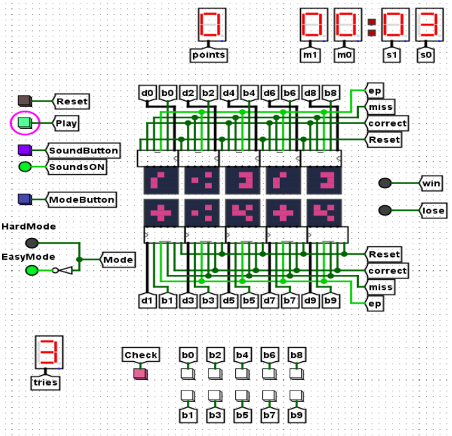
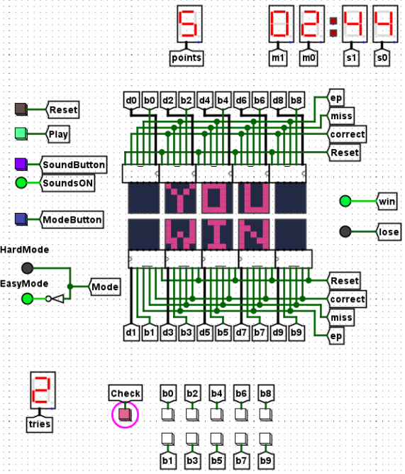
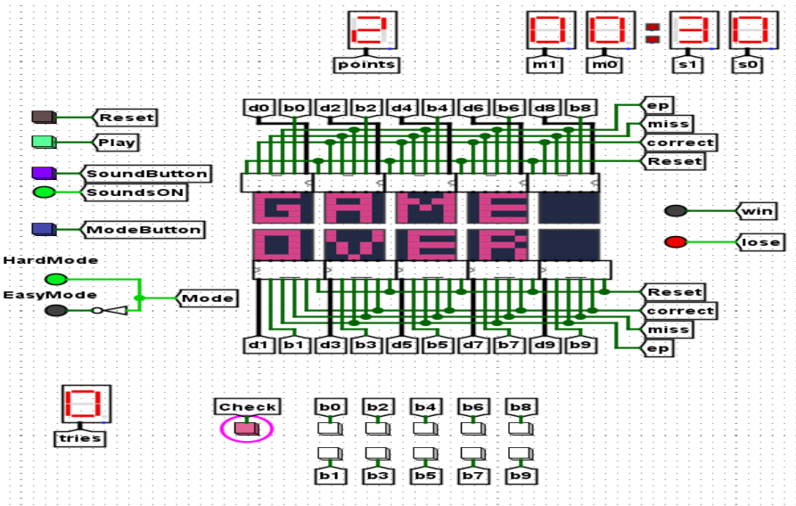
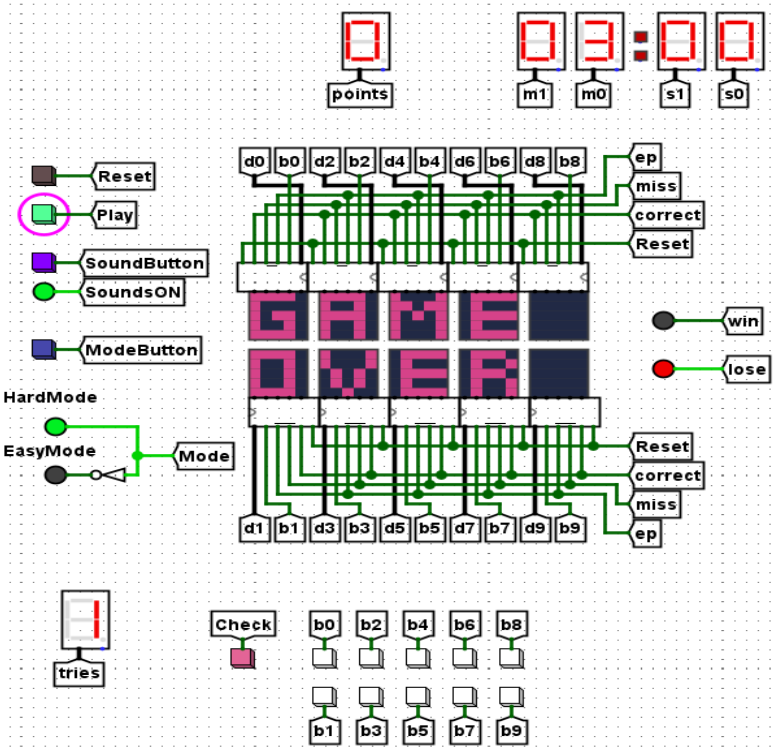

# 🎮 Memory Game - Logisim Evolution

A digital **Memory Game** project designed and built using **Logisim Evolution** as part of an academic course in digital design.

## 📚 Project Overview
The Memory Game challenges the player to find and match pairs of hidden symbols on a 5x5 board (10 cards in total).  
The player selects cards and checks if they match using a button. The game has two modes:

- **Easy Mode:**  
  3 lives, no time limit.

- **Hard Mode:**  
  1 life only, with a 3-minute timer.

If the player matches all the pairs, they win!  
If time runs out or lives are lost, they lose.

The project includes a user-friendly interface with optional sound effects and LED indicators for win/loss.

## 🛠️ Main Components
- **Game Board (10x 5x5 LED Matrices):**  
  Displays the cards in hidden, selected, or matched states.

- **Button Control System:**  
  10 buttons for card selection, a "Check" button to verify pairs, a "Reset" button, and a "Sound ON/OFF" toggle.

- **Matching Logic System:**  
  Compares selected cards to determine if they match.

- **Timer System:**  
  3-minute countdown in Hard Mode, shown on 7-segment displays.

- **Score and Lives System:**  
  Tracks number of correct matches and remaining lives.

- **Game Over System:**  
  Lights up a green LED for a win, or a red LED for a loss.

- **Sound System:**  
  Plays sounds for card selection, match success, mistake, win, or loss. Can be toggled on/off.

- **Information Display (7-Segment Displays & LEDs):**  
  Shows time remaining, lives left, and game status.

## 📸 Screenshots

## ▶️ How to Run
- Open the project `.circ` file with **Logisim Evolution**.
- Press the **Reset** button to start a new game.
- Choose a mode: Easy (no time limit, 3 lives) or Hard (3 minutes, 1 life).
- Select two cards using the buttons.
- Press **Check** to see if they match.
- Keep matching until you win or lose!

## 🔧 Tools Used
- **Logisim Evolution** (for simulation and digital design)

## 👩‍💻 Authors
- Tatiana Abu Shakra - 212581037
- Maria Nahla - 207716762

Project supervised by Mr. Ofer Tzur.

## 📖 References
- 74LS04 Hex Inverter - Texas Instruments
- MCS-4 Micro Computer Set Data Sheet - Intel Corporation
- and more (see full list inside the project documentation).

---
